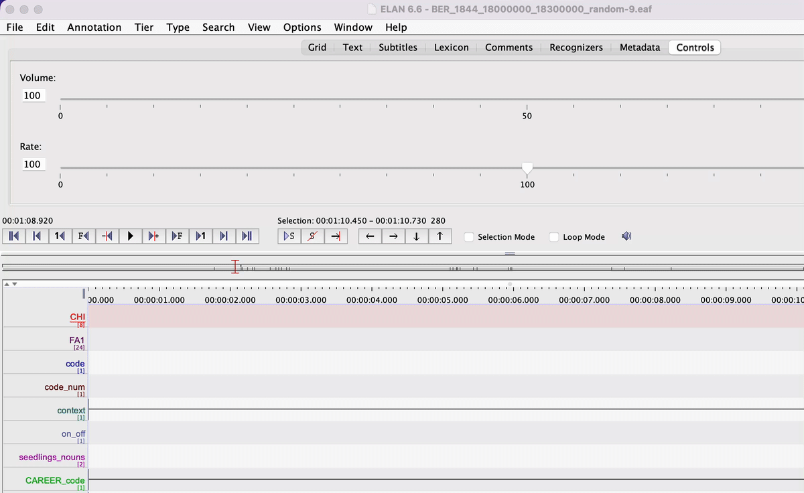
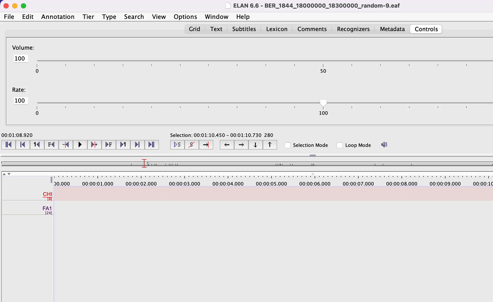
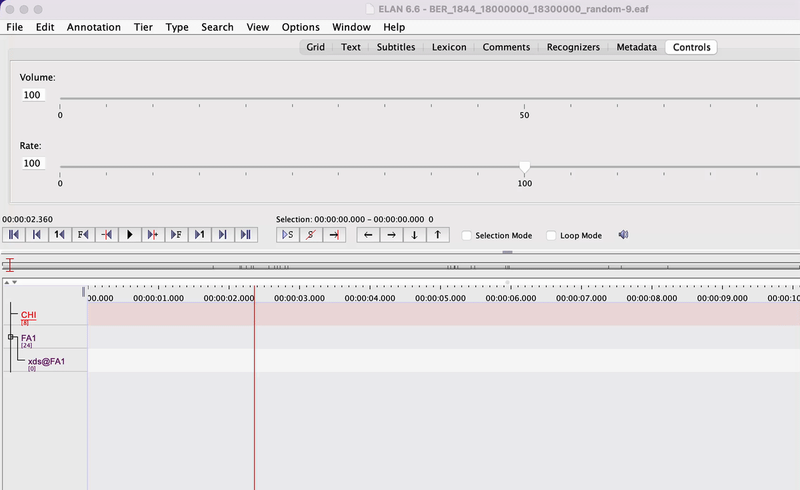
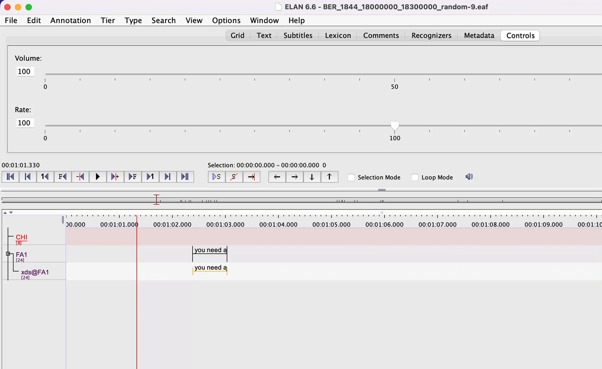
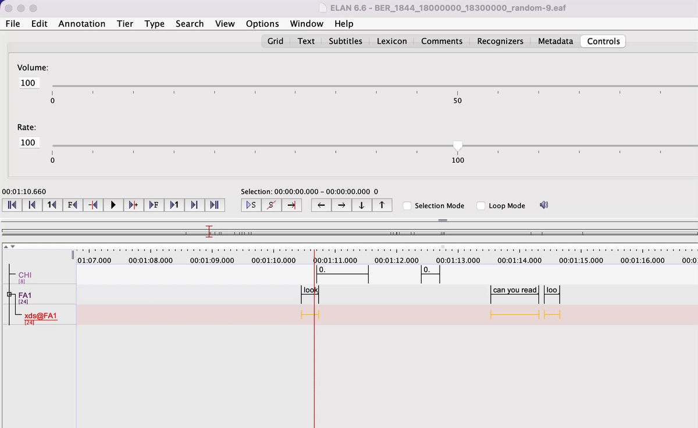
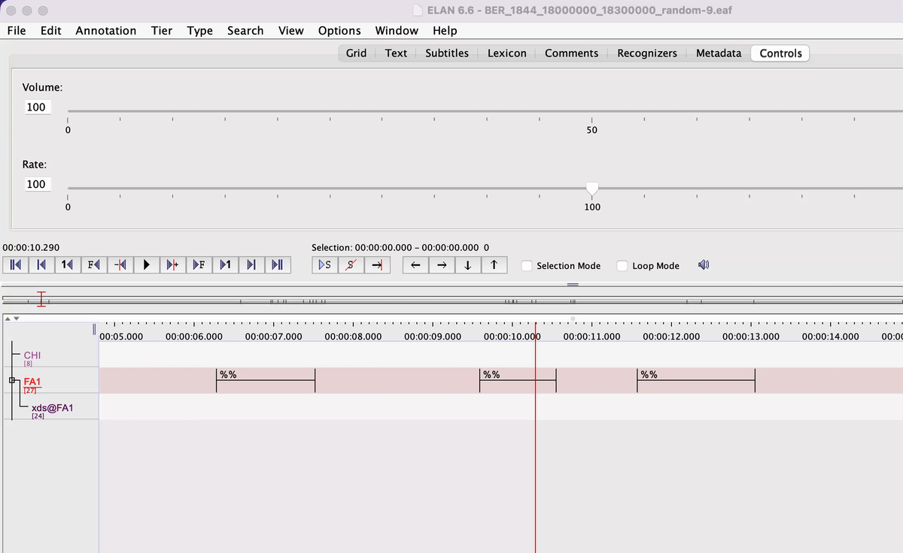
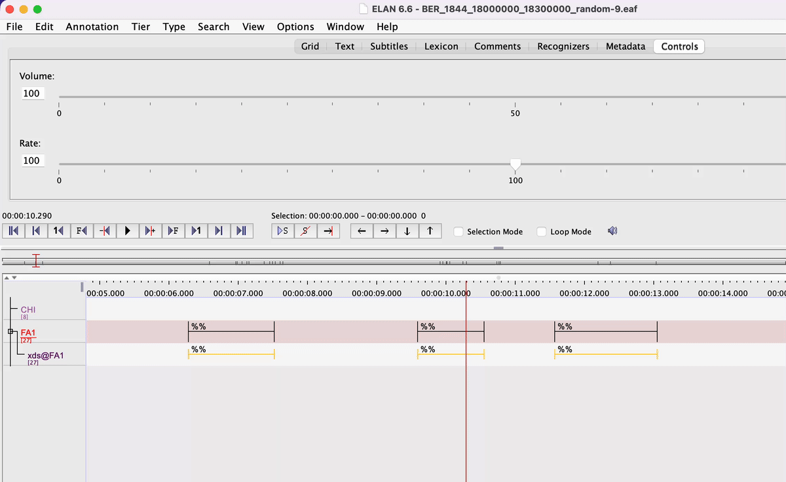

# CAREER OH Speech Segmentation

> [!WARNING]
> You must have completed **ACLEW Annotation Scheme Gold Standard Training** and **CAREER ENG Transcription Traning** before segmentation!

### Current task overview

A small portion of the transcribed clips from the parent project `CAREER-ENG-transcription` were randomly sampled. Chatter Lab RA's will be segmenting overheard speech, or speech that is not directed at TC (target child), in those clips.

### What's here

On this page, you can find:

1. Folders needed for segmentation
2. Workflow on how to set up files for segmentation and segment overheard speech

## Segmentation workflow

To begin segmentation, you must have access to the following folders and application:

1. [CAREER transcription team](https://uchicago.app.box.com/folder/198109383319) folder
2. [CAREER OH speech segmentation](https://uchicago.app.box.com/folder/346086493250) folder
3. [ELAN](https://archive.mpi.nl/tla/elan/download) software

Open all three items listed above, follow the workflow to begin your segmentation session.

### Part I: Locate files

1. In [CAREER OH speech segmentation](https://uchicago.app.box.com/folder/346086493250) folder, open [OH speech segmentation file tracker](https://uchicago.app.box.com/file/2017072696161) spreadsheet.

2. Locate the file name of the file you last worked on or the next un-segmented file. If you are starting on a fresh, unsegmented file, add your initials to `Segmentation annotator` and today's date to `First date worked on` columns.

3. Once you have located a file name, download the associated .wav file from `Recording URL` column.

4. Search and download the file name ending in .eaf format in [CAREER transcription team > annotator_files > completed](https://uchicago.app.box.com/folder/199422689005) folder. *You will notice there are likely multiple versions of the same file you are searching for; download the ***latest dated version*** (most likely under another annotator's "checks" folder)*

5. When you have both .wav and .eaf files, open them in [ELAN](https://archive.mpi.nl/tla/elan/download).

### Part II: Set up files for segmentation

1. Double check the .wav and .eaf files' names match.

2. In ELAN, listen to the full 5-min clip and identify speakers present. Add speaker tiers if they do not already exist in the file.

3. Next, we need to add `xds@`, or addressee, tiers.
    
    - In the top menu bar, find and click on `Type` > `Change Tier Type...`. This will lead to a pop-up window.
    - In the pop-up window's top menu bar, find and click on `Add` tab.
    - In the `Add` tab, find `Type Name` and input "addressee". In the same `Add` tab, find `Stereotype` and toggle down to choose "Symbolic Association".
    - Click on `Add` button located at the bottom. Exit the pop-up window.
      
      
      
    - In the top menu bar, find and click on `Tier` > `Add New Tier...` (or use the shortcut ⌘T). This will lead to a pop-up window.
    - In the `Add` tab, find `Tier Name` and input the correct `xds@` tier(s) needed for the file you are working on.
      - For **every** speaker you have, you will need to make a separate `xds@` tier for them. Each `xds@` tier should have the same format, which is "xds@" plus the three-character speaker codes (e.g., "FA1", "MA1", etc.). The complete format should, for example, look like "xds@FA1", "xds@MA1", etc.
      - In the same `Add` tab, find `Participant` and input the same three-character speaker codes matching your `xds@` tier.
        - e.g., if your `Tier Name` was "xds@FA1", your `Participant` should be "FA1".
      - In the same `Add` tab, find `Parent Tier` and toggle down to choose the correct parent tier.
        - e.g., if your `Tier Name` was "xds@FA1" and your `Participant` is "FA1", your `Parent Tier` should be "FA1".
      - **Double check there are no typos with your inputs!**
      - Once `Tier Name`, `Participant`, and `Parent Tier` are all filled out for the speaker, click on `Add` button.
      - Repeat the same process until you have a `xds@` tier for **every** non-TC speaker you have. Then, exit the pop-up window.
     
      
        
4. You should now see all the new `xds@` tiers you just added on the bottom left speaker tier panel. In the panel, right click on your mouse/trackpad, click on `Sort Tiers` > `Sort by Hierarchy`. This should help you better track your speakers and their associated `xds@` tiers.

5. Next, we need to create xds markings for all the existing TCDS (TC-directed speech).
    
    - In the top menu bar, find and click on `Tier` > `Copy Annotations from Tier to Tier...`. This will lead to a pop-up window.
    - In the pop-up window, find and choose the source tier (i.e., a three-character speaker code tier excluding `CHI`), then click on `Next` button. In the next page, find and choose the corresponding destination tier, which should always be in the format of "xds@" plus the source tier name, then click on `Next` button. In the next page, choose "All annotations", then click on `Finish` button.
      - e.g., if your source tier was "MA1", then your destination tier should be "xds@MA1", etc.
    - Repeat the same process for **every** non-TC speaker you have.
  
      
      
6. After you have copied existing TCDS annotations from source tier to destination tier for every non-TC speaker you have, we need to clean up and replace destination tier annotations.
    
    - In the bottom left speaker tier panel, highlight one `xds@` tier.
    - In the top menu bar, find and click on `Tier` > `Remove Annotations or Values...`. This will lead to a pop-up window.
    - In the upper half of the pop-up window, find and choose the same `xds@` tier you just highlighted. Then, in the bottom half of the same pop-up window, find and choose "Annotation Values" > "All Annotations". Then click on "OK" button and close the pop-up window.
      - You will see all the annotations in the highlighted `xds@` tier are now empty.

      

    - In the top menu bar, find and click on `Search` > `Find (and Replace)...` (or use the shortcut ⌘F). This will lead to a pop-up window.
    - In the pop-up window, find `An annotation on tier` and toggle down to choose the same highlighted `xds@` tier. Then, in the cell next to `that matches`, input "^$" (meaning "any empty annotation"). Click on `Search` button. 
      - The search should return all the annotations in the highlighted `xds@` tier since we just emptied them.
    - In the next page, on the top menu bar, find and click on `Replace`. This will lead to a smaller pop-up window. In this smaller pop-up window, input the letter "T" (capitalization matters here!), then click on `OK` button and close the pop-up window.
    - Repeat the same process for **every** non-TC speaker's `xds@` tier you have.

      
      
6. Now you are ready to begin segmenting overheard speech!

*If you want a visual version on how to set up files for segmentation, Dr. Casillas made a video tutorial, and the link to the tutorial can be found in [CAREER OH speech segmentation](https://uchicago.app.box.com/folder/346086493250) folder.*

### Part III: Overheard speech segmentation

1. **Double check the file you are working on is set up correctly!**

2. Segment all lexical vocalizations from non-TC speakers (you should not have to segment any vocalizations from TC or from other speakers that are TC-directed since they should have been segmented and transcribed beforehand). *As always, vegetative sounds such as sneezing and coughing should never be included.*

> [!CAUTION]
> All segmented overheard speech annotations should have the same annotation value "%%"!

3. Pay attention to utterance boundaries and speaker assignments.

4. After you have segmented all overheard speech and inputted the annotation value "%%", we need to tag their associated `xds@` annotations.

    - In the bottom left speaker tier panel, highlight one non-TC source tier.
    - In the top menu bar, find and click on `Tier` > `Create Annotations on Dependent Tiers...`. This will lead to a pop-up window.
    - In the pop-up window, check if the highlighted source tier is the one selected (it should be), then click on `Next` button.
    - In the next page, select `Annotation With Value of Parent`, then click on `Finish` button.
      - You should see the newly segmented annotations' associated `xds@` annotations are now copied, each with the annotation value "%%".

      
        
    - In the top menu bar, find and click on `Search` > `Find (and Replace)...` (or use the shortcut ⌘F). This will lead to a pop-up window.
    - In the pop-up window, find `An annotation on tier` and toggle down to choose the same highlighted `xds@` tier. Then, in the cell next to `that matches`, input "%%". Click on `Search` button. 
    - In the next page, on the top menu bar, find and click on `Replace`. This will lead to a smaller pop-up window. In this smaller pop-up window, input the letter "O" (capitalization matters here!), then click on `OK` button and close the pop-up window.
    - Repeat the same process for **every** non-TC speaker's `xds@` tier you have.

      
      
5. Once you are done segmenting a clip, input the speaker tiers and nicknames in the `Speaker ID` tab under [OH speech segmentation file tracker](https://uchicago.app.box.com/file/2017072696161).

6. Listen to the entire clip again to ensure you did not miss any vocalizations.

7. Upload the completely segmented .eaf file to [CAREER OH speech segmentation > completed_files](https://uchicago.app.box.com/folder/347024015997) folder.

8. Fill in any empty cells in the row associated with the file you just finished in [OH speech segmentation file tracker](https://uchicago.app.box.com/file/2017072696161).

9. Delete all local copies associated with the file you just uploaded to Box.

*If your shift ends before fully segmenting the file you are working on, upload the in-progress file to [CAREER OH speech segmentation > inprogress_files](https://uchicago.app.box.com/folder/347025323995) folder and resume the next time you have a shift.*
