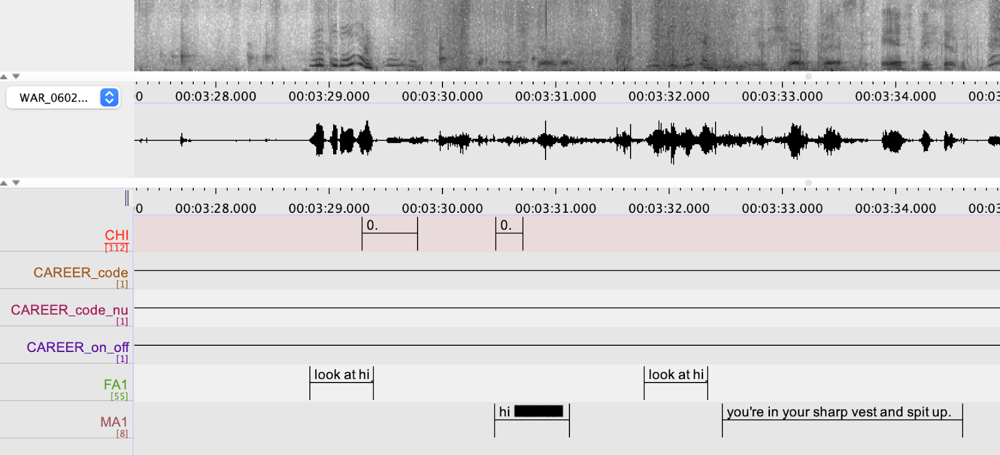
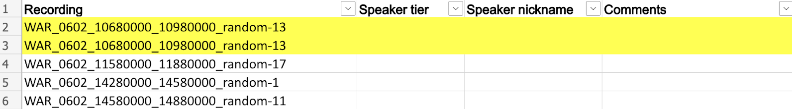
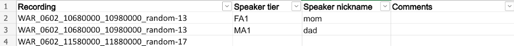
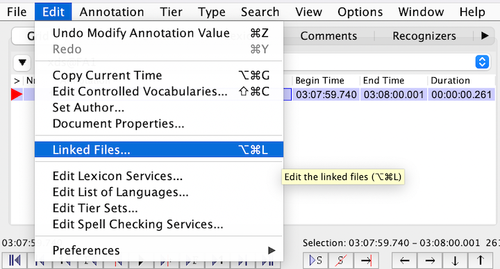
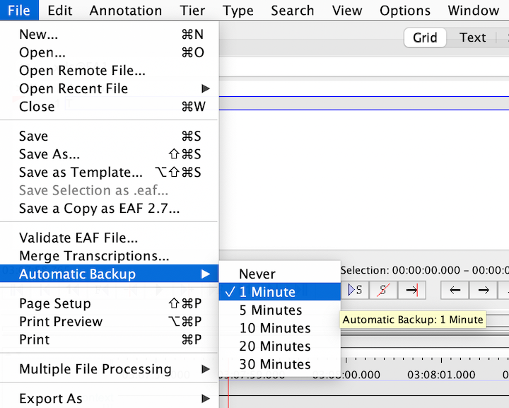
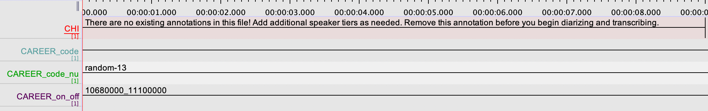
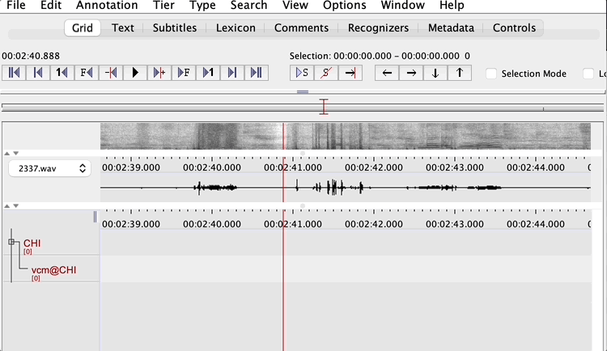

# CAREER-ENG-transcription

:exclamation:**NOTE: YOU MUST HAVE COMPLETED ACLEW ANNOTATION SCHEME GOLD STANDARD TRAINING BEFORE DOING TRANSCRIPTION**:exclamation: 

## Brief background
Dr. Casillas recently got an NSF grant for a project titled **Unknotting the noun bias in early language acquistion**:tada: Work on this project will continue over the next 5 years. One of the first parts of the project involves a comparative cross-linguistic corpus study using Tseltal and North American English data.

#### What is the noun bias?
The "noun bias" refers to a well-known, yet somewhat controversial, observation that nouns tend to be overrepresented in children's early vocabularies. The bias to learn nouns (specifically object nouns and proper nouns) before other types of words is considered a cross-linguistic universal, meaning that regardless of which language(s) a child is learning, they will learn nouns more readily than verbs early on. 

However, children do not exhibit the noun bias equally across all languages. Some languages, including Tseltal, are considered more "verb-friendly", meaning that the noun bias may be reversed or at least attenuated for Tseltal-learning children. There are several reasons why Tseltal can be considered verb-friendly, including:

* verb-object-subject (VOS) word order (English is SVO) so verbs appear in salient utterance positions
* there are many "specific" verbs (e.g., _lo’_ = eat soft thing, _k’ux_ = eat crunchy thing, _we’_ = eat tortilla, _ti’_ = eat meat, etc.) that are more noun-like
* adult caregivers infrequently label objects and instead tend to talk more about actions

#### How does spontaneous noun and verb use differ in Tseltal vs. English?
We will examine Tseltal- and English-learning children's noun and verb input (i.e., speech from others around them) and their own spontaneous noun and verb productions in daylong audio recordings (8–16 hours long). 

Dr. Casillas and her local collaborators in a Tenejapan village in southern Mexico already collected the Tseltal data. Daylong recordings were made by having young children wear a special vest that contained an audio recorder and a small photo camera. The child wore the vest while spending a day at home with their family, usually for a total of 7–11 hours. Then, Dr. Casillas would come by in the evening to collect the recorder, ask how the day went, and compensate the family for their participation. The English recordings were collected by US- and Canada-based researchers using a similar procedure. 

In total, we have 110 recordings (55 Tseltal, 55 English) from children up to age 4. After manual annotation of these recordings, we will be able to analyze the scope of differences in children's early  noun and verb use in two different languages and in multiple language communities, as well as how cross-linguistic differences change across age and how they reflect input patterns.

### Current task overview
For each English-learning child in our sample, chatterlab RAs will transcribe the speech they produce and the speech that is directly addressed to them in 2.5 hours of the recorded day. This includes 24 randomly-sampled 5-minute clips and 30 1-minute clips with the highest rates of child-and-other turn-taking.

### What's here

On this page, you will find links to the shared annotation tracker documents, information about where to find the files for annotation, and instructions on how to actually do the annotation.

Before you begin picking files from the [Annotation File Tracker](https://uchicago.app.box.com/file/1167435490002), you must complete [training](./training.md).

## Work session checklist

**Remember**: You will enter information into two separate places during each work session: (1) the [Annotation File Tracker](https://uchicago.app.box.com/file/1167435490002) and (2) the [ELAN](https://archive.mpi.nl/tla/elan/download) application.

1. Open up the [Annotation File Tracker spreadsheet](https://uchicago.app.box.com/file/1167435490002) for this project and check:
(a) which file you are currently working on and (b) where you left off. If this is your first work session or you are ready to move on to a new directory, then look for your initials in the `Annotator` column to see which directory you are assigned to annotate next. If you haven't been assigned a specific file, then pick one of the available files&mdash;add your initials to the `Annotator` column and today's date to the `Date first worked on` column.

2. Make sure that you have clocked in for your work session in Workday, and then set a timer to stop 5 minutes before the end of your planned work session.

3. If you are in the middle of annotating a file, download the latest version of your annotations from the ["in progress" folder](https://uchicago.app.box.com/folder/199422132179) or go to the folder with the most recent version of your eaf file on the lab computer you last worked on. The file should be named with the same name as the media file you are working with. If you are starting with a new directory, then immediately proceed with the [Annotation Workflow](#annotation-workflow) steps listed below.

4. When your timer goes off, update the following columns in the [Annotation File Tracker](https://uchicago.app.box.com/file/1167435490002): `Last date worked on` (today), `Last minute annotated`, and `Comments` (any general comments you want to add for posterity).

We also want to keep track of speaker identities across multiple clips from the same family. That is, if the target child’s mother is FA1 in clip 1 but FA2 in clip 2, we need a way to trace back her identity across clips!

Locate the `Speaker identity` tab on the [Annotation File Tracker](https://uchicago.app.box.com/file/1167435490002) and then locate the row matching the name of your clip in the `Recording` column. Duplicate the row for each non-CHI speaker present in your clip.

For example, look at the EAF file for WAR_0602_10680000_10980000_random-13 below. It has two non-CHI speakers, FA1 and MA1. We then locate the row for the recording in the [Annotation File Tracker](https://uchicago.app.box.com/file/1167435490002) and duplicate it once so that there are two rows for the recording (highlighted in yellow for demonstration purposes only).

Next, under the `Speaker tier` column, write the tier name for each non-CHI speaker tiers (e.g., “FA1” and “MA1”). For each speaker tier, write a nickname for it under the column `Speaker nickname`. This could be kinship terms like “mom” or “dad,” but it could also be names like “Subin” or short descriptions like “playground friend.” The nickname can be anything that is recognizable and helpful to you as you keep track of speakers across multiple clips! Just be sure to keep this nickname consistent across clips from the same family. That is, if you nickname someone “playground friend” in one clip, do not re-nickname the same person as “random friend” when they show up in a later clip. If it becomes clear that the person is a relative of the child, please add that to the nickname (e.g., “Subin - older sister”) and update past uses of that nickname accordingly. So, for example, you might initially call a voice “playground friend” and then later realize it’s an older sister named “Subin”. If you are sure this is the case, you can replace the prior “playground friend” entry so that it says “Subin - older sister” and then use that entry going forward. If you change a past entry this way, please double-check the audio first to be 100% sure.

Add any comments about any ambiguities you faced in identifying the speaker in the `Comments` column; you may also leave this cell blank.

Going back to our example of WAR_0602_10680000_10980000_random-13, this clip had two non-CHI speaker tiers: FA1 and MA1. FA1 and MA1 were the target child’s mother and father respectively.

If there are no non-CHI speakers or no speakers (e.g. child is sleeping) in the clip, put a single zero (0) in the `Speaker tier` and `Speaker nickname` columns for that row.

5. Upload your eaf file to the ["in progress" folder](https://uchicago.app.box.com/folder/199422132179). The only exception?: If you are done annotating this directory AND you have completed all of the items in [the checklist at the bottom of this page](#completed-file-checklist), then copy your eaf file to the ["completed" folder](https://uchicago.app.box.com/folder/199422689005) instead.

6. If you have downloaded a file but haven't finished fully annotating and checking it, make sure that you have written "no" under the `Local copy deleted?` column. If you are done annotating this directory, then delete ALL local files relating to this directory and clear your trash after upload and mark "yes" in the `Local copy deleted?` column.

7. Please keep track of the _total_ time it takes you to segment, transcribe, and check all utterances in the file. Add this time (in minutes), along with the number of speakers and number of utterances summed across all speakers to the `Time/speaker/utterance tracking` column. This information should be in "XXmins, Xspkrs, XXutts" format. 

8. Please make sure to note the version of the instructions you used while doing your annotations. Under the `Annotation guide version` column, you should list **1.2**. Remember to check back each time you start a work session to see if there have been any changes to the instructions!

8. Clock out of Workday and update your contributions accordingly.

9. Close all files and programs so that the data are not on display if/when someone else uses or catches a glance at your computer.

Please keep this workflow open for every session so that you are sure not to skip a step. Thank you!

## Annotation workflow
Download the 2 files needed for the current recording:

* wav file found in the `Recording URL` column
* eaf file found in the `Recording annotations` column

**Double check that the names match each other _and_ the name in the `Recording` column**. If there are any issues, notify the Lab Manager and skip to the next available file.

Take note of the current time, so you can mark down how long it takes to code each file.

Move the files to the _same_ location on your local computer.

Launch the ELAN application and open the eaf file. The wav file should already be linked, but if not, relink it (⌥ ⌘ L).

Set the automatic backup to 1 minute.

Put on a pair of fully functioning **over-ear** headphones. Lab headphones are typically located in the bins above the computers at all of the RA workstations. Play a portion of clip and adjust the volume so that the audio is comfortable but you can hear very well what is happening.

Check the existing information in the file. Because we are using other researchers' data, some of the files have already been partially annotated using a version of the ACLEW annotation scheme. **You should review and correct any existing annotations as needed to match the annotation instructions for this project!** Edits can include deleting utterances, adding utterances, adjusting utterance boundaries, altering the transcription, switching annotations to different tiers, etc.

**At minimum, you should see 4 tiers:**

`CAREER_code` - denotes the portion of the 5-minute clip that should be coded for this file

* for random clips, this is the entire file
* for high-tt clips, this is just a single minute

`CAREER_code_num` - which of the 24 random clips or 30 high-tt clips you are working on (you can ignore/hide this tier!)

`CAREER_on_off` - the start time and end time of the code clip in the full daylong recording for this participant (you can ignore/hide this tier!)

`CAREER_context` - for high-tt clips only, a 5-minute clip that contains the 1-minute clip to be coded (you can ignore/hide this tier!)

`CHI` - vocalizations produced by the target child

* In some cases, target child speech has been segmented but has not been transcribed. Use the rules [here](#for-target-child-speech-chi-tier) to decide what should be transcribed or removed
* If there are no existing annotations, there is a note at the beginning of the file in this tier
* **IMPORTANT**: Add "CHI" as the "Participant" name (⌘ T to Change Tier Attributes)

**Other tiers**

Additional speaker tiers (e.g., `FA1`, `MA1`) may exist. For any existing annotations in these tiers, confirm that they match our rules for segmentation/transcription [here](#for-target-child-directed-speech-segment-diarize--transcribe-speech-that-is-exclusively-addressed-to-the-target-child)

Additional tiers named `code`, `code_num`, `on_off`, and `context` may also exist. These should be fully ignored/hidden but should remain stored in the files so that we can easily reintegrate with existing data.

Some of the recordings that begin with the name "BER" include one additional tier called `seedlings_nouns`. This tier includes annotations marking the onset and offset of utterances that contain object nouns. The timings might not be exactly right but can be used as a reference for your own transcription.

**Issues?** If you notice anything strange about your file (e.g., existing annotations that do not match the audio, negative annotion durations, missing core 4 tiers, etc.), please contact the Lab Manager and skip to the next available file.

### Annotation task: Transcribe target child speech and target-child-directed speech

##### Reference the adapted minCHAT rules for this project [here](https://docs.google.com/document/d/1Yu1gYxCm-QxagArh9-PUrlFz_QsikLy_pqAbuwOVL5Q/edit?usp=sharing) 

#### For target child speech (`CHI` tier): 

* Segment all **linguistic** vocalizations
	* This includes fussing but excludes laughing/crying/other non-linguistic sounds (e.g., blowing raspberries)	 that do not co-occur with speech
	* As always, vegetative sounds should never be included
* Only transcribe **lexical** vocalizations. All non-lexical utterances should have the annotation value **"0."**
	* If words and non-words co-occur in the same utterance, then transcribe the words and use **"xxx"** to denote the remaining non-lexical vocalizations
	* For phonology-related mispronunciations (e.g., when a child produces "peas" when trying to say "please" or "na" when trying to say "banana", simply transcribe the adult form (i.e., "please", "banana"). You do _not_ need to use **"\<___\> [: ___]"** notation
	* For morphosyntactic errors (e.g., "eated”), transcribe the word as produced, but use the corrective minCHAT markup ("\<eated\> [: ate]")
	* For unintelligible speech, always use **"xxx"** and add modality-related information as applicable (e.g., "\<xxx\> [=! cries]" or "\<xxx\> [=! whines]")
	* Use the **@c** tag to indicate child- or family-specific words (consistent with minCHAT) along with non-adult-like uses of dictionary words
* For infant vocalizations, be sure to segment vocalizations according to [breath groups](https://docs.google.com/presentation/d/1X_psbiEClZMIzP5LZtocLduDGf4au8h2yWZA6cBJ-Cc/edit?usp=sharing)
* Do not add dependent tiers (`vcm@CHI`, `lex@CHI`, or `mwu@CHI`)

#### For target child-directed speech: Segment, diarize, & transcribe speech that is _exclusively_ addressed to the target child

* Add new tiers (⌘ T) with 3-letter speaker codes (e.g., `FA1`, `MA1`, etc.) as needed
* Ignore **"\<___\> [: ___]"** for shortened forms (e.g., "kay" = "okay"), uncommon contractions (e.g., "ther're" = "there are"), and assimilations (e.g., "lemme" = "let me"). Review more details about these rules [here](https://docs.google.com/document/d/1Yu1gYxCm-QxagArh9-PUrlFz_QsikLy_pqAbuwOVL5Q/edit?usp=sharing)
* Do not include non-linguistic vocalizations that do not co-occur with speech (i.e., "&=laugh hello." should not be included but "\<hello\> [=! laughs]" is a valid annotation value
* Adult imitations of babbles should be segmented but not transcribed if not lexical (i.e. `0.` if the whole utterance is non-lexical and `words xxx.` for utterances with words and babble imitations)
* Do not add `xds@XXX` tiers

**For all transcription, please follow the our [adapted minCHAT guidelines for this project](https://docs.google.com/document/d/1Yu1gYxCm-QxagArh9-PUrlFz_QsikLy_pqAbuwOVL5Q/edit?usp=sharing)**

## minCHAT checker
Before uploading your annotation file to the completed folder, you must check and correct any minCHAT errors. Please review what the checker [does](#what-the-checker-looks-for) and [does not](#what-the-checker-does-not-look-for-so-you-must-check-yourself) look for to make sure that you manually check your own files as needed.

### [Launch the minCHAT eaf checker](https://aclew.shinyapps.io/minCHAT-eaf-checker/)
* Upload your eaf file
* Click "no" under the question `Are you following the ACLEW Annotation Scheme (AAS) exactly?`
* Upload [this csv file](https://uchicago.app.box.com/file/1169512550769) under `Add new legal tier names?`
* Check the box under `Keep any existing AAS tier names`
* Check **all** of the boxes under `Remove expected AAS dependent tiers?`

### Error report

##### What the checker looks for
* tier names matching the "CAREER-tier-names.csv" input or the standard 3-character AAS speaker names
* transcriptions with too few or too many terminal markers
* transcriptions with extra spaces, including: 2+ spaces in a row, a space in the utterance-initial postion, a space before a terminal marker, and/or a space after a terminal marker
* the use of square brackets follows one of the following patterns: <blabla> [: blabla], <blabla> [=! blabla], or [- lng]
* the use of @ follows one of the following patterns: blabla@s:eng, blabla@l, or blabla@c

##### What the checker does NOT look for (so you MUST check yourself!)
* spelling errors
* use of &= or =! followed by a verb in the third-person tense
* proper use of capital letters of hyphenated words; but it does return a list of these for manual review
* proper use of hyphens and ampersands to indicate cut-off/restarted speech (e.g., he- or he&, -in or &in)

## Completed file checklist

- [ ] Have you added "CHI" as the Participant name (⌘ T to Change Tier Attributes)?
- [ ] Have you checked for _and_ corrected any [minCHAT errors](#minchat-checker)?
- [ ] If there are no target child vocalizations, have you deleted the "There are no existing annotations in this file..." annotation?
- [ ] Have you listened to the entire clip again and double checked all of your annotations?
- [ ] Have you noted the total time it took to annotate/check the file, the number of utterances, number of speakers, and any other relevant comments in the [Annotation File Tracker spreadsheet](https://uchicago.app.box.com/file/1167435490002)?
- [ ] Have you updated the “Speaker identity” tab in the [Annotation File Tracker spreadsheet](https://uchicago.app.box.com/file/1167435490002) with tier names, speaker nicknames, and any relevant comments for all non-CHI speakers in the file?

## Questions?
**Please make use of the `#cl-career` slack channel!** 

If you want to provide an audio clip for context, then (1) select the clip, (2) right click on the waveform > Clip Selection..., (3) choose the file name **with the .wav extension** and location where the file should be saved on your local computer.

